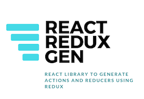

# react-redux-gen
Redux-gen will generate actions, thunk and reducers in one line using naming conventions and API based.

You can use fully if you have an standard object CRUD, like an User, or use the plain actions and extend with your async actions.

This is based on Redux. If this is too advanced for you, and you need to know more in how to use redux, please check the guides: https://redux.js.org/recipes/reducing-boilerplate

## Purpose
Redux Gen generate actions and reducers based on convention, and there's many use cases to use the way you want

## Why?
As the application increase, the process of create actions and reducers is pretty repetitive and we can get a lot of benefits if we use the same language that API REST naming conventions if we are connecting on an API.

## Methods

You can use these three utility functions from react-redux-gen:

`import { genActionNames, genPlainActions, genAsyncActions } from 'react-redux-gen'`

### genActionNames

Returns the action names in a object so you can use to be referecend later, like on reducers

`genActionNames(entity, types, states)`

| Parameter     | Type          | Description           | Default                                                |
| ------------- | ------------- | --------------------- | ------------------------------------------------------ |
| entity        | String        | The entity name       | There's no default for this one                        |
| types         | Array         | Types of action       | Array('create', 'update', 'delete', 'list', 'fetch')   |
| states        | Array         | States of request     | Array('REQUESTED', 'SUCCESS', 'ERROR')                 |  

### genPlainActions

Returns the action functions in a friendly way to be used to dispatch actions

`genPlainActions(entity, types, states)`

| Parameter     | Type          | Description           | Default                                                |
| ------------- | ------------- | --------------------- | ------------------------------------------------------ |
| entity        | String        | The entity name       | There's no default for this one                        |
| types         | Array         | Types of action       | Array('create', 'update', 'delete', 'list', 'fetch')   |
| states        | Array         | States of request     | Array('REQUESTED', 'SUCCESS', 'ERROR')                 |  

For `REQUESTED` state, it will return the following action object:

```
{ type: 'ENTITY_TYPE_REQUESTED', completed: false, error: false }
```

For `SUCCESS` state, it will return the following action object:

```
{ type: 'ENTITY_TYPE_SUCCESS', completed: true, data: data, error: false }
```

For `ERROR` state, it will return the following action object:

```
{ type: 'ENTITY_TYPE_ERROR', completed: true, error: error }
```

### genAsyncActions

Returns the async action standard function to communicate with rest API. These functions make calls to api's based on the base URL, dispatching request action, success when succeed, and error when the the call to the api fails. We use axios to make our calls.

`genAsyncActions(entity, url, headers, types, states)`

| Parameter     | Type          | Description                 | Default                                                |
| ------------- | ------------- | --------------------------- | ------------------------------------------------------ |
| entity        | String        | The entity name             | There's no default for this one                        |
| url           | String        | The base url to call        | There's no default for this one                        |
| headers       | Object        | Extra headers               | There's no default for this one                        |
| types         | Array         | Types of action             | Array('create', 'update', 'delete', 'list', 'fetch')   |
| states        | Array         | States of request           | Array('REQUESTED', 'SUCCESS', 'ERROR')                 |  

### Example

This is a basic example to use to define the CRUD actions for your `user` object

```
import { genPlainActions, genAsyncActions } from 'react-redux-gen'

const userActions = genPlainActions('user')
const userAsyncActions = genAsyncActions('user', '/users)

export { userActions, userAsyncActions }
```

This code above will generate the actions needed with states `REQUESTED`, `SUCCESS` and `ERROR` for actions and the async actions with the basic calls from these states.

#### This will generate the following actions object:

```
{
  'create': ['CREATE_USER_REQUESTED', 'CREATE_USER_SUCCESS', 'CREATE_USER_ERROR'],
  'update': ['UPDATE_USER_REQUESTED', 'UPDATE_USER_SUCCESS', 'UPDATE_USER_ERROR'],
  'delete': ['DELETE_USER_REQUESTED', 'DELETE_USER_SUCCESS', 'DELETE_USER_ERROR'],
  'list': ['LIST_USER_REQUESTED', 'LIST_USER_SUCCESS', 'LIST_USER_ERROR'],
  'fetch': ['FETCH_USER_REQUESTED', 'FETCH_USER_SUCCESS', 'FETCH_USER_ERROR'],
}
```

#### And the following async actions from a base url

Our generated async actions is like this:
```
import axios from 'axios'
import { genPlainActions, genActionNames } from 'react-redux-gen'

const actions = genPlainActions('user', '/authenticated', ['action'])
// [0] => REQUESTED, [1] => SUCCESS, [2] => ERROR

const example = () => {
  return dispatch => {
    dispatch(actions.action[0]())
    return axios
      .get('/authenticated')
      .then( response => {
        return dispatch(actions.action[1](response.data))
      }).catch( e => {
        return dispatch(actions.action[2](e))
      })
  }
}
```

### Important NOTE!

The async actions is still experimental and we don't support much customization for these case, and we hope to improve this for new releases.

### How to use

With the async object is possible to dispatch actions from this call, for example:

`genAsyncActions('user', 'http://example.com/user/')['create']({name: 'jonh doe'})`

Will dispatch 
`{ type: 'CREATE_USER_REQUESTED', completed: false }`, `{ type: 'CREATE_USER_SUCCESS', error: false, completed: true, data: {name: 'John doe'} }`, 

and for an error on create:

will generate `{ type: 'CREATE_USER_REQUESTED', completed: false }`, `{ type: 'CREATE_USER_ERROR', error: {}, completed: true }`

If you want to pass headers to axios, you should run like this example:

```
import { genPlainActions, genAsyncActions } from 'react-redux-gen' 

const headers = {
    'Authorization': `Basic ${process.env.REACT_APP_SECRET}`,
    'Content-Type': 'application/json'
  }

const userActions = genPlainActions('user')
const userAsyncActions = genAsyncActions('user', '/users', headers)

export { userActions, userAsyncActions }
```

### And for reducers

```
import { genReducer } from 'react-redux-gen'

const user = genReducer('user', { data: {}, error: false, completed: true }) // the object and initial state

export default user
```

### Custom examples

If you want to use just the actions and use your own async actions, feel free to do like the example below for a login action:
```import axios from 'axios'
import { genPlainActions, genActionNames } from 'react-redux-gen'
import { host } from '../url'

import Auth from '../modules/Auth'

const headers = {
  'Authorization': `Bearer ${Auth.getToken()}`,
  'Content-Type': 'application/json'
}

const loginActionNames = genActionNames('user', ['logged', 'login', 'logout'])
const loginActions = genPlainActions('user',['logged', 'login', 'logout', 'register'])

const logged = () => {
  return dispatch => {
    dispatch(loginActions.logged[0]())
    return axios
      .get(host + '/authenticated', { headers: {
        'Authorization': `Bearer ${Auth.getToken()}`,
        'Content-Type': 'application/json'
      }
      })
      .then( response => {
        return dispatch(loginActions.logged[1](response.data))
      }).catch( e => {
        return dispatch(loginActions.logged[2](e))
      })
  }
}

const login = (user) => {
  return dispatch => {
    dispatch(loginActions.login[0]())
    return axios
      .post(host + '/authorize/local', user)
      .then( response => {
        return dispatch(loginActions.login[1](response.data))
      }).catch( e => {
        return dispatch(loginActions.login[2](e))
      })
  }
}

const logout = () => {
  return (dispatch) => {
    dispatch(loginActions.logout[0]())
    if(Auth.deauthenticateUser()) {
      return dispatch(loginActions.logout[1]({}))
    }
    return dispatch(loginActions.logout[2](new Error('we have an error to logout, try again later')))
  }
}

const register = (user) => {
  return dispatch => {
    dispatch(loginActions.register[0]())
    return axios
      .post(host + '/auth/register', user)
      .then( response => {
        return dispatch(loginActions.register[1](response.data))
      }).catch( e => {
        return dispatch(loginActions.register[2](e))
      })
  }
}


export { loginActionNames, loginActions, logged, login, logout, register }
```

### Reducer
For a login reducer, we could use
```
import {
  loginActionNames
} from '../actions/login'

const login = (state = { completed: true, data: {}, error: false }, action) => {
  switch (action.type) {
    case loginActionNames.logged[0]:
      return { ...state, completed: action.completed }
    case loginActionNames.logged[1]:
      return { ...state, completed: action.completed, data: action.data, error: false }
    case loginActionNames.logged[2]:
      return { ...state, completed: action.completed, error: action.error }
    case loginActionNames.logout[0]:
      return { ...state, completed: action.completed, error: action.error }
    case loginActionNames.logout[1]:
      return { ...state, completed: action.completed, error: action.error, data: action.data }
    case loginActionNames.logout[2]:
      return { ...state, completed: action.completed, error: action.error }
    default:
      return state
  }
}

export default login
```

## Contribute

### Run the first time
`yarn install`

### Run the project
`yarn start`

### Run the tests
`yarn test`


### Contributors
This package is maintained by [Alexandre Magno](https://alexandremagno.net)
